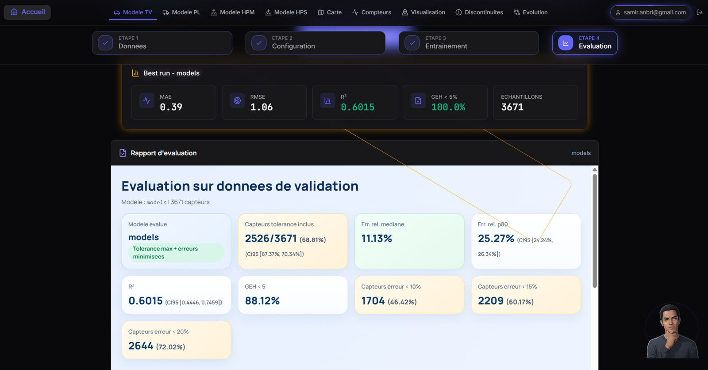
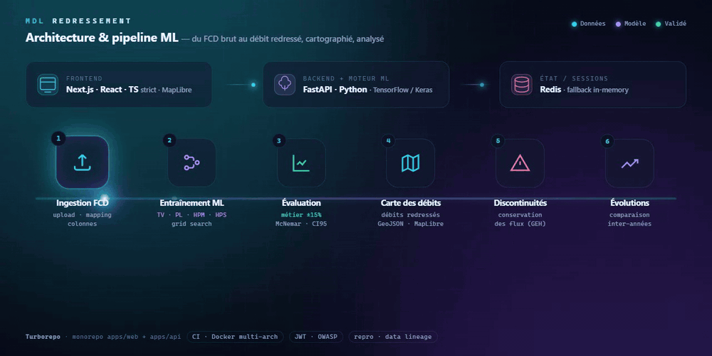
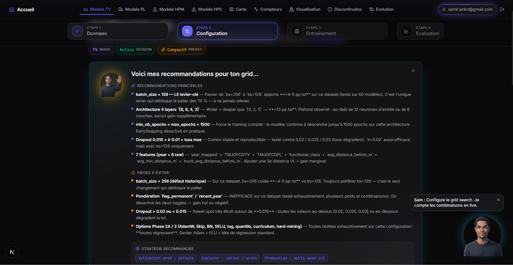
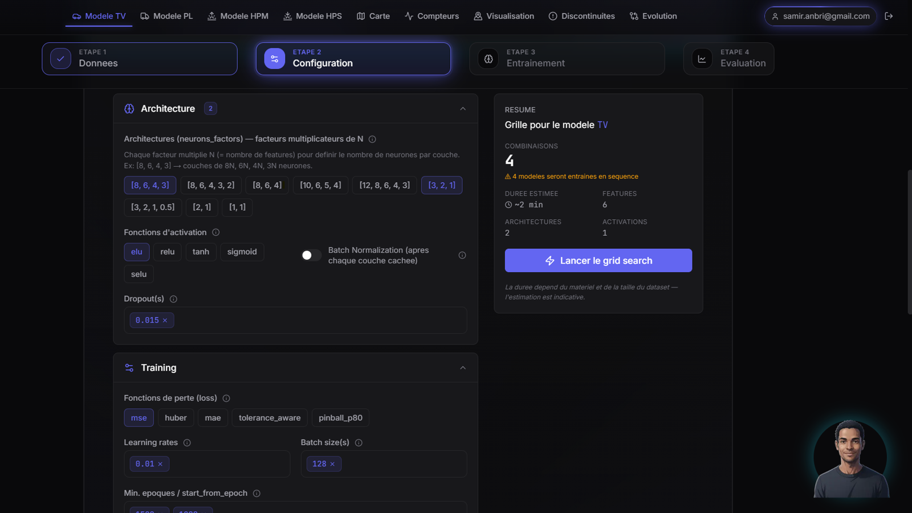
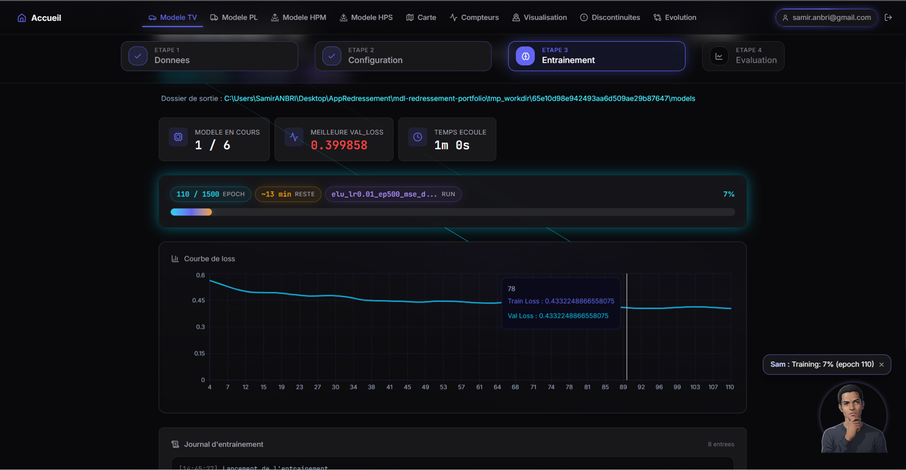
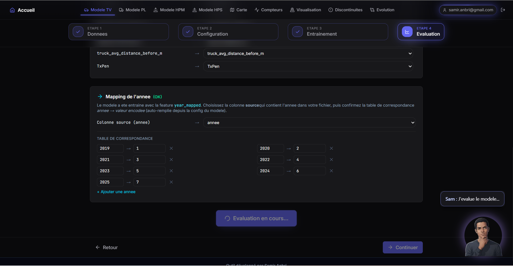
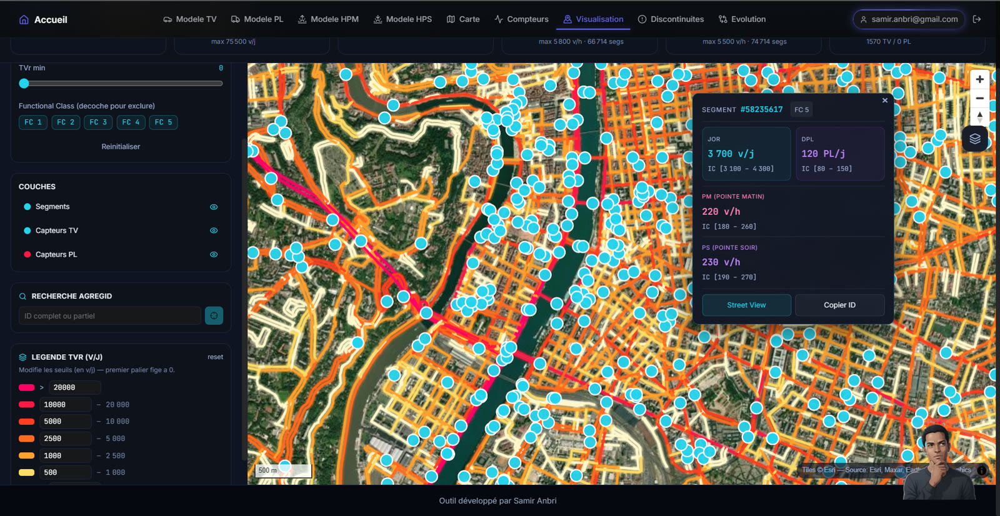
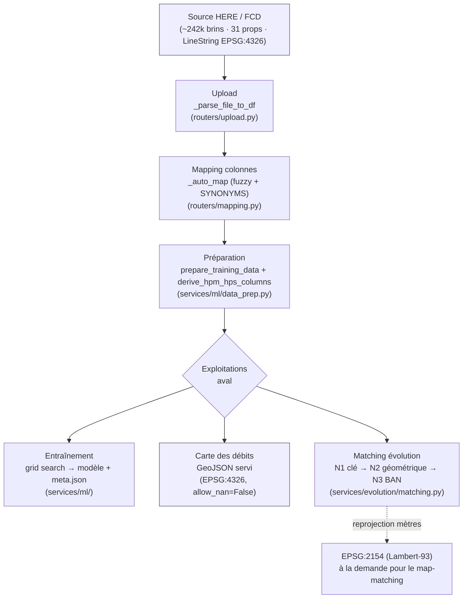
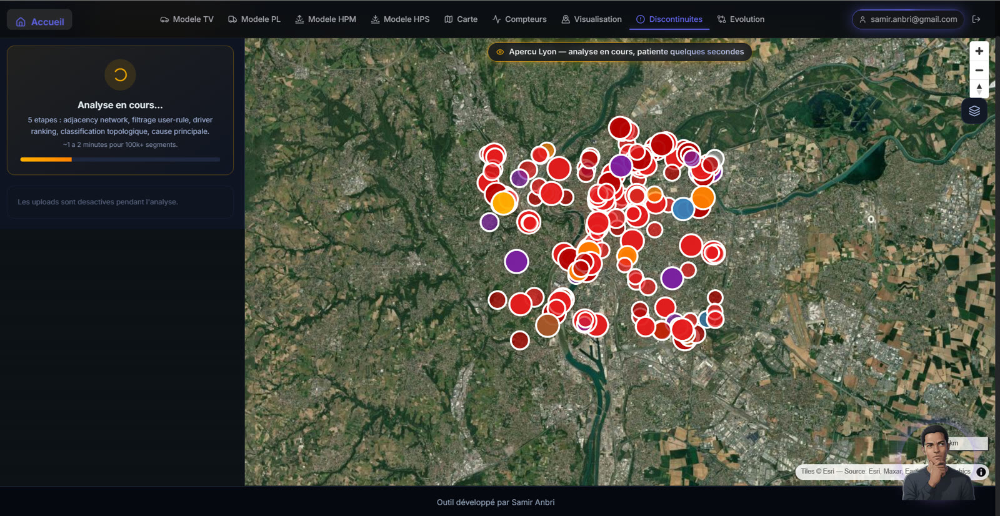
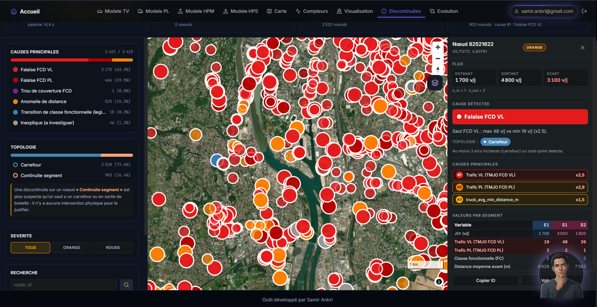

<div align="center">

# MDL Redressement

### Du Floating Car Data brut au débit routier redressé, cartographié et tracé — full-stack + moteur ML, de bout en bout.

[](https://www.python.org)
[](https://fastapi.tiangolo.com)
[](https://nextjs.org)
[](https://react.dev)
[](https://www.typescriptlang.org)
[](https://www.tensorflow.org)
[](https://turbo.build)
[](https://www.docker.com)
[](https://github.com/anbsamsam17/machine-learning-traffic-redressement-platform/actions)
[](./LICENSE)

**[Démo en ligne](https://Trafic-Tool.anbri-tools-ia.online)** · **[Méthodologie discontinuités](scripts/discontinuity_methodology/00_METHODOLOGY.md)**

Auteur : **Samir Anbri**

[samir.anbri@gmail.com](mailto:samir.anbri@gmail.com) · [GitHub @anbsamsam17](https://github.com/anbsamsam17)
<!-- LinkedIn: <url a ajouter> · CV: <url a ajouter> -->

</div>

---

## Aperçu animé

<p align="center"><strong>Connexion — fond animé</strong></p>
<p align="center"></p>

<br>

<p align="center"><strong>Accueil — grille des modules</strong></p>
<p align="center"></p>

<br>

<p align="center"><strong>Évaluation statistique sous contrainte métier</strong> — R², taux de tolérance, McNemar</p>
<p align="center"></p>

---

## Vision globale

Les données FCD (Floating Car Data) brutes **sous-estiment systématiquement** les débits réels du réseau. **MDL Redressement** est une plateforme **full-stack de bout en bout** qui industrialise tout le cycle de vie du redressement de débits routiers — de la donnée brute à la décision cartographiée — avec une traçabilité ML complète. Là où le redressement reste d'ordinaire un travail artisanal, peu reproductible et difficile à auditer, un **seul outil couvre toute la chaîne** :

1. **Entraîner** des modèles ML de redressement pour **quatre familles métier** — **Tous Véhicules (TV)**, **Poids Lourds (PL)**, **Heure de Pointe Matin (HPM)** et **Heure de Pointe Soir (HPS)** — via un grid search entièrement piloté depuis l'interface.
2. **Évaluer et comparer** les modèles sous **contraintes métier** (tolérance opérationnelle ±15 %) **et statistiques** (bootstrap CI95, test de McNemar pairé, drift temporel), pour **sélectionner le meilleur modèle** en toute confiance.
3. **Générer la carte des débits redressés** : application du modèle retenu sur l'ensemble du réseau FCD → GeoJSON cartographié (Grand Lyon, 12-15k+ tronçons).
4. **Analyser les discontinuités** du réseau une fois la carte produite : conservation des flux aux nœuds (GEH), détection et **attribution automatique des causes**.
5. **Analyser les évolutions inter-années** : comparaison des débits redressés d'une année sur l'autre pour quantifier les tendances de trafic.

S'y ajoutent l'**export Fichier Compteurs** (format standardisé) et la **visualisation des capteurs**. Le fil rouge de toute la plateforme : la **reproductibilité et le lineage ML** à chaque étape. L'objectif assumé n'est pas le R² brut mais une **métrique opérationnelle** — le taux d'échantillons dans la tolérance ±15 % (`tol_in_pct`) — qui oriente l'architecture, les fonctions de perte et l'évaluation.

---

## Ce que ce repo démontre

Chaque brique est implémentée et vérifiable dans le code. Le tableau ci-dessous fait le lien entre les compétences mises en œuvre et les profils auxquels elles correspondent.

| Brique technique | Compétence démontrée | Type de poste |
|---|---|---|
| Moteur MLP quantile + pertes custom (`model_builder.py`, `losses.py`) | Conception d'architectures, fonctions de perte métier, Keras 3 | **ML Engineer** |
| `meta.json` + seed déterministe + data lineage SHA-256 (`packaging.py`, `seeding.py`) | Traçabilité, rejouabilité, packaging d'artefacts | **MLOps** |
| Pipeline FCD → GeoJSON + map-matching inter-millésimes (`data_prep.py`, `geo.py`, `evolution/matching.py`) | Ingestion, transformations géospatiales, projections CRS | **Data Engineer (géo)** |
| Grid search + curriculum / hard-example mining + k-fold (`grid_search.py`, `kfold.py`, `training_pipeline.py`) | Recherche d'hyperparamètres, validation croisée | **ML Engineer** |
| CI multi-arch + Docker Compose + déploiement SSH (`.github/workflows/ci.yml`, `infra/`) | Conteneurisation, intégration et livraison continues | **DevOps / MLOps** |
| Évaluation McNemar apparié + bootstrap CI95 + drift temporel (`stats_compare.py`, `metrics_advanced.py`) | Statistiques inférentielles, comparaison rigoureuse de modèles | **ML / Stats** |
| Garde-fous d'entraînement + sécurité (IDOR, path-traversal, zip-bomb) (`training_guard.py`, `security.py`) | Durcissement applicatif, contraintes de production | **Backend / MLOps** |

---

## Démo

**[Trafic-Tool.anbri-tools-ia.online](https://Trafic-Tool.anbri-tools-ia.online)**

Ce qu'on peut y tester en ligne :

- Le pipeline complet d'un modèle TV ou PL : upload → mapping de colonnes → configuration du grid search → entraînement → évaluation.
- La carte interactive des débits redressés du Grand Lyon (12-15k+ tronçons, filtres et seuils éditables en runtime).
- L'analyse des discontinuités du réseau (conservation des flux aux nœuds, classification automatique des causes).

---

## Architecture

<p align="center">
  
</p>

Monorepo **Turborepo** (`turbo.json`, workspaces `apps/*`) : un frontend **Next.js** typé strict, un backend **FastAPI** qui embarque le moteur ML **TensorFlow/Keras**, **Redis** pour les sessions, le tout conteneurisé derrière un reverse-proxy (Docker Compose, Nginx/Caddy dans `infra/`). Le diagramme ci-dessus déroule le pipeline complet, de l'ingestion FCD jusqu'aux analyses de discontinuités et d'évolutions inter-années.

### Stack technique

| Couche | Technologies |
|---|---|
| Monorepo / build | Turborepo, npm workspaces, Node ≥ 20 |
| Frontend | Next.js 16 (App Router), React 19, TypeScript 5 (`strict: true`), Tailwind CSS v4, shadcn/ui, MapLibre GL, TanStack React Query, Zustand, Framer Motion, GSAP, Recharts |
| Backend | FastAPI, Pydantic / pydantic-settings, Uvicorn, python-jose (JWT), bcrypt, SlowAPI (rate limiting), pandas, geopandas, scipy, scikit-learn |
| ML | TensorFlow CPU + Keras, NumPy, scikit-learn |
| Données / état | Redis (sessions, fallback in-memory), PyArrow, GeoJSON / EPSG:4326 |
| Observabilité | Sentry, Prometheus (`prometheus-fastapi-instrumentator`), logs JSON structurés + request-id |
| Infra / CI | Docker Compose, Nginx, Caddy, GitHub Actions (build multi-arch amd64/arm64, déploiement SSH) |
| Qualité | pytest, ruff, black, mypy, ESLint |

---

## Pipeline ML illustré

Le cœur de la démonstration : l'enchaînement **configuration du grid search → entraînement → évaluation**, entièrement piloté depuis l'interface.

#### Configuration du grid search (modèle TV)

| | |
|:---:|:---:|
|  |  |

*À gauche : assistant de configuration du grid search (modèle TV) avec recommandations chiffrées d'hyperparamètres (batch size, dropout, learning rate, `neurons_factors`, epochs). À droite : configuration fine de l'architecture et du training — `neurons_factors` par couche, activations multiples (elu/relu/selu/tanh/sigmoid), normalisation par couche, fonctions de perte custom (mae/huber/tolerance_aware/pinball), learning rates et batch size. Le compteur de combinaisons matérialise la taille du grid search avant lancement. L'espace de recherche affiché correspond aux axes du produit cartésien implémenté dans `grid_search.py`.*

#### Entraînement

<p align="center"></p>

*Suivi temps réel du grid search : modèle 1/6 en cours, meilleure `val_loss` courante (0.399858), ETA et courbe train/val loss tracée en direct. Chaque combinaison est entraînée sous re-seed déterministe par run (`run_seed = seed + run_idx`), avec progression streamée epoch par epoch (callback Keras `on_epoch_end`). Le suivi epoch-par-epoch reflète les callbacks EarlyStopping et ReduceLROnPlateau du `training_pipeline`.*

---

## Moteur ML — redressement de débits par MLP quantile

Tout le code ML vit dans `apps/api/app/services/ml/`, strictement séparé de la couche applicative.

### Architecture du modèle (MLP paramétrable)

`model_builder.py` construit un perceptron multicouche dont la profondeur et la largeur sont pilotées par un vecteur de facteurs : `neurons_factors=[2, 1, 0.5]` produit des couches cachées de `input_size×2`, `input_size×1`, `input_size×0.5` neurones. Le builder bascule automatiquement de l'API Sequential vers l'API Functional dès qu'une fonctionnalité l'exige (embedding, skip-connection, tête quantile), tout en garantissant que le graphe Keras reste **byte-identique** au chemin historique quand aucune option n'est activée — les checkpoints existants continuent de round-tripper via `model.save()` / `load_model()`.

Ce qui distingue ce builder d'un MLP standard, vérifié dans le code :

- **Tête multi-quantile** : sortie à 3 neurones pour q ∈ {0.2, 0.5, 0.8}, compilée avec une perte somme-de-pinballs construite à la volée (`_multi_quantile_loss`). La prédiction principale en aval est la médiane q=0.5, les bornes 0.2/0.8 fournissant un intervalle d'incertitude.
- **SELU self-normalizing** : quand l'activation est SELU, le builder force `lecun_normal` + `AlphaDropout` et désactive toute couche de normalisation — application correcte du papier SNN, pas un copier-coller approximatif.
- **Embedding d'année** : la colonne `year_mapped` peut être routée vers une couche `Embedding` apprise plutôt que traitée comme un scalaire continu, avec slice/cast/clip encapsulés dans des couches custom sérialisables.
- **Régularisation fine** : AdamW avec weight decay découplé, `clipnorm` (gradient clipping global), dropout schedule décroissant, choix BatchNorm / LayerNorm / none.

### Fonctions de perte custom (`losses.py`)

Trois pertes métier sont implémentées comme sous-classes `keras.losses.Loss` avec `get_config`/`from_config` (donc **persistées avec le modèle**) et enregistrées sous des alias string :

- **`PinballLoss(quantile=0.8)`** — pour q > 0.5 elle pénalise davantage la **sous-prédiction** que la sur-prédiction, ce qui répond directement au mode de défaillance opérationnel : la sous-correction systématique des forts débits.
- **`ToleranceAwareLoss(tolerance=0.15, penalty_factor=1.5)`** — MAE en espace z-score avec surpénalité (+50 %) des échantillons hors de la bande de tolérance. La docstring est honnête sur l'approximation : la tolérance est interprétée en fraction d'écart-type plutôt qu'en % relatif dénormalisé, faute d'injecter `mu_y/sigma_y` comme constantes du graphe.
- **`HuberLoss(delta=0.25)`** — Huber avec delta resserré (vs 1.0 par défaut Keras), adapté à des résidus z-scorés vivant dans ~[0, 1].

Détail qui trahit une vraie maîtrise de Keras 3 : les alias sont injectés non seulement dans `get_custom_objects()` mais aussi directement dans `keras.src.losses.ALL_OBJECTS_DICT`, car le chemin de résolution string de Keras 3 ne consulte pas le premier registre.

### Anti-fuite de données : normalisation train-only

Point critique souvent raté, ici fait correctement. Dans `training_pipeline.py`, les statistiques de normalisation sont **ajustées exclusivement sur le split d'entraînement**, puis réappliquées tel quel à la validation et au jeu complet :

- cible Y : `mu_y, sigma_y` fittés sur `y_train`, réutilisés pour `y_valid` et `y_all` ;
- features X : `mu_x, sigma_x` fittés sur `x_tr`, réutilisés sur `x_va` et `x_all`.

`normalize.py` propose en plus un scaler **robuste** (médiane, IQR/1.349) en alternative au z-score, le facteur 1.349 étant correctement justifié pour aligner l'échelle robuste sur celle d'une normale.

### Recherche d'hyperparamètres et validation croisée

`grid_search.py` génère le produit cartésien complet des axes : sous-ensembles de features (avec colonnes obligatoires et masque binaire), activation, learning rate, epochs, loss, dropout, `neurons_factors`, batch size, plus les axes optimizer / weight decay / skip / schedule / clipnorm / norm layer / tête quantile. Les loss et optimizers invalides sont rejetés **fail-fast** plutôt que de retomber silencieusement sur MSE. Le `run_name` encode déterministiquement la combinaison complète.

`kfold.py` apporte la rigueur qui manque à un simple holdout : il ré-entraîne le modèle k fois (k ∈ [2,10]) avec **exactement les mêmes hyperparamètres**, force `test_size=0` (le fold tenu de côté jouant le rôle de validation), et **décale le seed par fold** (`seed + fold_idx`) pour éviter une estimation de variance optimiste où tous les folds partiraient des mêmes poids. Le résumé renvoie moyenne et **écart-type non biaisé (ddof=1)** sur `tol_in_pct`, `p80`, `r2`.

Le pipeline embarque aussi un EarlyStopping (patience 30, `start_from_epoch` configurable), un ReduceLROnPlateau, du **curriculum learning two-phase** (30 % des epochs sur les 50 % d'échantillons les plus faciles) et du **hard-example mining** qui booste les `sample_weight` des erreurs résiduelles en cours d'entraînement.

---

## Évaluation & MLOps

L'enjeu n'est pas seulement d'entraîner un réseau : c'est de pouvoir **prouver** qu'un modèle est meilleur qu'un autre, de **rejouer** un entraînement à l'identique, et de **tracer** quelles données ont produit quels poids.

#### Évaluation statistique des modèles

| | |
|:---:|:---:|
|  |  |

*À gauche : étape d'évaluation, mapping reproductible de la feature `year_mapped` (table 2019→1 … 2025→7) avant l'évaluation sur données de validation. Ce même encodage annuel alimente le calcul du drift temporel année par année. À droite : rapport d'évaluation sur le jeu de validation — best run sélectionné (R²=0.6015, taux dans tolérance 88.12 %, comptage de capteurs dans/hors tolérance sur 3671). Ces métriques sont enrichies en coulisses par des IC95 bootstrap (1000 rééchantillonnages, seed 1750), une stratification par volume de trafic et un test de McNemar apparié.*

### Reproductibilité bit-exact (seed 1750)

`seed_everything()` (`seeding.py`) ne se contente pas d'un `np.random.seed` : elle propage une seed unique à **tous** les générateurs aléatoires de la chaîne — Python `random`, NumPy, TensorFlow, Keras — fixe `PYTHONHASHSEED`, et active `tf.config.experimental.enable_op_determinism()` pour rendre les opérations TensorFlow elles-mêmes déterministes (op-determinism activé une seule fois, en amont de la boucle, car idempotent).

Dans la boucle de grid search (`training_pipeline.py`), un re-seed déterministe est appliqué **avant chaque `model.fit`** : pour chaque run le pipeline calcule `run_seed = seed + run_idx` (où `seed` est la base-seed, 1750 par défaut, et `run_idx` l'index 0-based du modèle dans le grid), puis appelle `seed_everything(run_seed, enable_op_determinism=False)` et `tf.keras.utils.set_random_seed(run_seed)`. Chaque candidat est ainsi initialisé reproductiblement *et* distinctement de ses voisins, ce qui évite que le grid ne s'effondre sur quelques tuples `(tol, p80)` répétés. Cette même `run_seed` est embarquée dans le `meta.json` du modèle, garantissant la rejouabilité exacte run par run.

### Packaging traçable & data lineage (`meta.json`)

Chaque modèle exporté embarque un `meta.json` construit par `build_meta()` (`packaging.py`) :

- **Versions d'environnement** capturées dynamiquement : Python, TensorFlow, Keras, NumPy, scikit-learn, OS, hostname.
- **Git SHA** du commit qui a produit le modèle (`git rev-parse HEAD`), pour relier les poids au code source exact.
- **Seed** utilisée — donc rejouabilité.
- **SHA-256 des données d'entraînement** via `data_sha256_of()` (hash stable du contenu du DataFrame, index inclus). C'est du **data lineage** réel : on peut prouver a posteriori sur quel jeu de données un modèle a été entraîné.

Chaque sonde est interrogée **défensivement** : un échec est enregistré dans le manifeste plutôt que levé, donc le packaging ne casse jamais sur un outil manquant. Le bundle ZIP embarque architecture, poids, coefficients de normalisation, config et métriques — un artefact autoportant.

Exemple de `meta.json` produit par `build_meta()` (valeurs tronquées, plausibles) :

```json
{
  "saved_at": "2026-06-18T14:32:07.481236+00:00Z",
  "python_version": "3.11.9",
  "platform": "Linux-6.8.0-45-generic-x86_64-with-glibc2.39",
  "hostname": "mdl-train-01",
  "seed": 1750,
  "data_sha256": "9f4b1c0e7a2d8f6b3e5c1a09d7f24b8e6c0a3d51f9b27e4c8a16d0f3b5e7c9a2",
  "tf_version": "2.17.0",
  "keras_version": "3.4.1",
  "numpy_version": "1.26.4",
  "sklearn_version": "1.5.1",
  "git_sha": "c37c213af8e1b4d9026f5a7c3e8b1240d9f6a3e1",
  "format": "legacy-h5-zip"
}
```

### Évaluation statistique rare pour le domaine

`metrics_advanced.py` et `stats_compare.py` calculent, en pur NumPy/pandas (donc testables unitairement) :

- **Intervalles de confiance 95 % par bootstrap** (1000 rééchantillonnages, seed 1750) sur les métriques clés, avec gestion des poids rééchantillonnés en lockstep. Garde-fou : retourne `None` sous 30 échantillons.
- **Drift temporel** : R², MAE, taux dans tolérance et p80 recalculés **année par année** sur `year_mapped` — détecte qu'un modèle se dégrade sur les millésimes récents.
- **Stratification par volume de trafic** en 4 buckets (0-1k, 1k-5k, 5k-20k, 20k+) : une métrique globale masque qu'un modèle peut exceller sur le trafic fort et s'effondrer sur la longue traîne.
- **Comparaison de modèles par test de McNemar apparié** sur l'issue binaire « capteur dans la tolérance » : table de contingence 2×2 sur les cellules discordantes, **chi-2 avec correction de continuité (Edwards 1948)** au-delà de 25 discordances, sinon **test binomial exact bilatéral**. Verdict **directionnel** : un modèle n'est déclaré meilleur que s'il a strictement plus de capteurs dans la tolérance **ET** que le test est significatif à α = 0,05.

### Garde-fous d'entraînement (production)

`training_guard.py` borne le coût qu'un utilisateur peut imposer à l'API :

- **Verrou de concurrence par utilisateur** : un second entraînement simultané du même compte est rejeté en HTTP 409.
- **Plafond de grille** : le produit cartésien des axes est refusé en HTTP 400 au-delà de `MAX_GRID_COMBINATIONS` (défaut 100).
- **Deadline wall-clock** : consultée depuis le callback Keras `on_epoch_end`, elle force `model.stop_training` au-delà de `MAX_TRAINING_MINUTES` (défaut 30).

Ces garde-fous vivent dans `app/` (pas dans la couche TensorFlow), donc testables sans importer TF.

### Reproductibilité & idempotence

Au-delà de la seed unique, plusieurs mécanismes concrets garantissent qu'un run est rejouable à l'identique et qu'une étape réexécutée ne corrompt rien :

- **Re-seed déterministe par run** (`training_pipeline.py`) : avant chaque `model.fit`, le pipeline calcule `run_seed = seed + run_idx` (base-seed 1750, `run_idx` 0-based) puis appelle `seed_everything(run_seed, enable_op_determinism=False)` et `tf.keras.utils.set_random_seed(run_seed)`. Chaque candidat du grid est ainsi initialisé reproductiblement et distinctement. *(`derive_seed` dans `seeding.py` est du code mort, conservé sans être appelé par cette boucle.)*
- **`seed_everything` multi-RNG + op-determinism** (`seeding.py:23`) : propagation à Python `random`, NumPy, TensorFlow et Keras, `PYTHONHASHSEED` fixé, et `tf.config.experimental.enable_op_determinism()` activé une seule fois en amont (idempotent).
- **Écritures Parquet déterministes** (`session.py:83`, `_df_to_parquet_safe`) : sérialisation via `pyarrow`, casting JSON stable des cellules dict/list, **aucun fallback Pickle** — le même DataFrame produit les mêmes octets.
- **Dérivations idempotentes** (`data_prep.py:47`, `derive_hpm_hps_columns`) : les colonnes HPM/HPS et `TxPen` ne sont (re)calculées que si absentes ; un snapshot déjà enrichi est laissé intact, donc réexécuter la préparation est sans effet de bord.
- **Cache de reprise BAN** (`evolution/matching.py:527`) : le reverse-geocoding BAN indexe les résultats par `src_idx` dans un cache muté en place ; une génération relancée saute les points déjà résolus (reprise idempotente).
- **JSON strict `allow_nan=False`** (`evolution/io.py:128`, `routers/evolution.py:460`) : l'export GeoJSON refuse tout `NaN`/`Infinity`, garantissant un payload conforme et reproductible.

---

## Data Engineering & cartographie géospatiale

Le réseau routier du Grand Lyon, c'est **~242 000 brins directionnels HERE** par millésime, **31 propriétés par tronçon**, et une géométrie LineString en EPSG:4326. En sortir une carte web fluide, des comparaisons inter-annuelles fiables et un diagnostic de qualité automatisé exige un pipeline data robuste.

**Convention CRS** : la géométrie est **conservée en EPSG:4326 (WGS84) en entrée comme en sortie** (`evolution/io.py` ne reprojette jamais au chargement) ; la reprojection en **EPSG:2154 (Lambert-93)** n'a lieu **qu'à la demande**, le temps des calculs métriques en mètres du map-matching (`evolution/matching.py`), pour ne jamais altérer la géométrie servie au front.

#### Carte des débits redressés

<p align="center"></p>

*Carte des débits redressés — 12-15k+ tronçons rendus en une seule LineLayer MapLibre, palette graduée par expression GPU, filtres et seuils édités en runtime sans rebuild de source. Le popup expose JOr (v/j), DPL (PL/j), pointes matin/soir avec intervalles de confiance, et lien Street View.*

### Pipeline de données : du FCD brut au GeoJSON servi

Vue d'ensemble du flux, de la source FCD jusqu'aux trois exploitations aval (entraînement, carte, matching d'évolution). Les fonctions citées sont celles réellement appelées dans le code.

**Garde-fous de volume à l'ingestion** : chaque upload est plafonné à **`MAX_UPLOAD_MB` = 500 MB** (rejet HTTP 413 au-delà), les archives shapefile sont contrôlées contre les **zip-bombs** (taille décompressée totale > **1 Go** refusée avant traitement), et le **parsing reste in-memory** (octets bruts → DataFrame, sans écriture disque intermédiaire).



*Formats : tables source (CSV/GeoJSON) → DataFrame → **Parquet** déterministe pour l'état de session, **GeoJSON** strict (`allow_nan=False`) pour les exports carte/évolution. CRS : tout vit en **EPSG:4326** ; le map-matching reprojette en **EPSG:2154 (Lambert-93)** à la demande pour raisonner en mètres.*

- **Jointure référentielle FCDREFGLOBAL** défensive sur les noms de colonnes : `FCD_COLUMN_MAPPING` traduit les colonnes source vers les noms canoniques internes, avec **facteur d'échelle** (km → m via ×1000), gestion des alias de clé (`segment_id`/`AgregId`/`agregId`) et **non-écrasement des endpoints graphe** déjà présents côté GeoJSON (`discontinuites.py:1108`). Un export amont renommé ne casse pas silencieusement un run.
- **Optimisation du payload carte** (`scripts/map_2025_light/prepare_data.py`) : un GeoJSON source de **~81 MB / 98 129 LineStrings / 31 props** est réduit à 15 propriétés utiles, coordonnées **arrondies à 5 décimales (~1,1 m)**, volumes castés en entiers, valeurs par défaut omises (`RAMP/ROUNDABOUT 'Y'/'N' → 1/0` puis drop des zéros, `n_merged==1` omis, `PL==0` omis). Sortie minifiée **+ jumeau gzip compresslevel 9**. Le front reconstruit les valeurs manquantes.
- **Parsing géométrique factorisé** (`geo.py`) : parsing défensif str/dict, calcul de cap par orthodromie, arrondi LineString/MultiLineString/Point centralisés plutôt que redéfinis à chaque endpoint.

### Matching géospatial inter-millésimes

Comparer les débits 2019 vs 2025 suppose d'apparier chaque tronçon à son homologue. Le réseau bouge (resegmentation, nouveaux brins) : une simple jointure de clé ne suffit pas. Le pipeline d'appariement (`evolution/matching.py`) est à **3 niveaux** :

1. **N1 — clé exacte** sur `agregId` (suffixe directionnel `-F`/`-T` inclus), unicité garantie.
2. **N2 — map-matching géométrique** sur le résiduel : reprojection en **EPSG:2154 (Lambert-93)** pour travailler en mètres, candidats via **STRtree `dwithin`** (rayon paramétré par classe fonctionnelle : FC1=25 m … FC5=8 m), **gate de sens dur** (rejet si écart azimutal ≥ 120°), **score composite** (IoU de buffers, couverture, distance point-ligne, Hausdorff, ratio de longueurs, similarité directionnelle), puis **affectation hongroise** (`scipy linear_sum_assignment`) **par cluster local** (composantes connexes du graphe biparti) pour imposer l'unicité 1↔1.
3. **N3 — vérification BAN** (Base Adresse Nationale) en **filtre de sécurité uniquement** : reverse-geocoding des points milieux, comparaison de noms de voie (tokens normalisés + Jaccard). Un MISMATCH **rétrograde** `GEOM_AUTO → GEOM_VERIF` mais ne **promeut jamais** un appariement — décision conservatrice assumée.

Détails prod : appels BAN par **lots de 8 000** avec **retry backoff exponentiel**, **cache idempotent** pour reprise, **court-circuit réseau** quand aucune colonne de nom de voie n'est disponible, et **aucun état global muté** (seuils injectés en paramètres → deux générations concurrentes via `asyncio.to_thread` n'interfèrent pas).

### Analyse des discontinuités du réseau

| | |
|:---:|:---:|
|  |  |

*À gauche : détection à l'échelle métropole — pipeline en 5 étapes (graphe d'adjacence, filtre règle utilisateur, ranking des drivers, classification topologique, cause principale). Chaque nœud est un point de rupture de conservation des flux. À droite : diagnostic d'un nœud — graphe orienté reconstruit depuis le schéma HERE, écart de flux entrant/sortant chiffré, cause classifiée automatiquement (Falaise FCD VL x2.5), topologie (Carrefour) et drivers rankés. Causes principales agrégées sur tout le réseau dans le panneau gauche (Falaise FCD VL 63,5 %, etc.).*

Le diagnostic repose sur une reconstruction de graphe routier dirigé, puis sur la physique de conservation des flux — pas sur des seuils arbitraires :

- **Graphe orienté depuis le schéma HERE** : direction déduite du suffixe `-F`/`-T` de `agregId` (`in_node = NREF_IN_ID` / `out_node = REF_IN_ID` et inversement), avec **alignement de la géométrie** sur le sens de circulation, drop des endpoints invalides et auto-boucles, dédup `agregId` (`discontinuites.py:271`). L'adjacence native HERE encode déjà la jonction physique.
- **Conservation aux nœuds via GEH** : à chaque jonction, Σ flux entrant vs Σ flux sortant. Le **GEH** (`sqrt(2·(M−C)² / (M+C))`, statistique standard DMRB / Highways England) est calculé par nœud. Flag en **OR** (GEH > 15 **ou** déséquilibre relatif > 18 %, plancher 3 000 véh/j), les deux captant des régimes différents.
- **Classification automatique des causes** : scoring de drivers (falaise FCD VL/PL via ratio max/min ≥ 1,5, transition de classe fonctionnelle, anomalie de distance), **cascade de cause principale** et **topologie** (Bretelle > Carrefour > Continuité). Variante **vectorisée numpy** (`_detect_drivers_from_arrays`) pour passer à l'échelle réseau sans conversion pandas par nœud.

### Rendu MapLibre performant

Le composant `MapView` (`apps/web/components/map/MapView.tsx`) rend l'intégralité du réseau en **un seul source GeoJSON + une LineLayer**, sans clustering : 12-15k+ LineStrings tiennent sans broncher.

- **Palette graduée via expressions MapLibre** (`step` sur le volume JOr/TVr, largeur expression-driven) — le GPU fait le travail, pas le JS.
- **Recolorisation runtime sans rebuild** : éditions de seuils via `setPaintProperty`, filtres utilisateur via `setFilter` — aucune reconstruction de source.
- **Hover via `setFeatureState`** + couche de hit transparente élargie (12 px) pour des clics confortables sur des lignes fines.
- **Respect de `prefers-reduced-motion`**, **bbox fit maison** (évite d'importer `@turf/bbox`, ~250 kB économisés), fit déclenché seulement au changement d'identité du GeoJSON.

---

## Sécurité

Points vérifiés dans le code :

- **JWT fail-fast au boot** (`config.py`) : l'API refuse de démarrer si `JWT_SECRET` est vide, contient `change-me`, ou fait moins de 32 caractères.
- **Anti-IDOR** (`tests/test_ownership.py`, `session.py`) : l'accès à une session d'un autre utilisateur renvoie **404 et non 403** — pour ne pas divulguer l'existence de la ressource.
- **Anti path-traversal** (`security.py`) : namespacing disque par utilisateur ET par session, `validate_path` résout les symlinks des deux côtés et rejette toute sortie du root autorisé, ainsi que les octets NUL.
- **Anti zip-bomb** (`routers/upload.py`) : contrôle de la taille décompressée totale (limite 1 Go) avant traitement des archives shapefile.
- **Headers OWASP** (`middleware/security_headers.py`) : HSTS, CSP, `X-Frame-Options: DENY`, `X-Content-Type-Options: nosniff`, `Referrer-Policy`, `Permissions-Policy` sur chaque réponse (y compris erreurs).
- **Durcissement production** : `/docs`, `/redoc`, `/openapi.json` désactivés, `/metrics` restreint par allow-list d'IP, `/health` minimal, CORS strict limité aux origines configurées.
- **Mots de passe** : bcrypt (`auth.py`). Aucun seed utilisateur en production.

---

## Tests & CI

- **pytest** (`apps/api/tests/`, 451 tests — `cd apps/api && python -m pytest -q --co` → `451 tests collected in 7.64s`) : fixtures métier, transformations de données (`test_data_prep`, `test_normalize`, `test_mapping`), ML (`test_losses`, `test_seeding`, `test_packaging`, `test_grid_search`, `test_stats_compare`), sécurité (`test_ownership` IDOR + path-traversal, `test_security_headers`, `test_auth_flow`), et tous les routers.
- **CI GitHub Actions** (`.github/workflows/ci.yml`) : `ruff` + `black --check` (backend), `eslint` (frontend), `pytest` avec service Redis, puis build d'images Docker **multi-arch (amd64/arm64)** poussées sur GHCR et déploiement SSH (avec approbation manuelle via environnement `production`).

---

## Méthodologie (étude de cas)

Étude de cas mise en avant : **détection de discontinuités de débits TVr** sur un réseau HERE de **241 857 brins** — voir [`scripts/discontinuity_methodology/00_METHODOLOGY.md`](scripts/discontinuity_methodology/00_METHODOLOGY.md).

Document maître **auto-suffisant** (un dev peut réimplémenter à partir du seul fichier) : pipeline en 7 stages, schémas de sortie, **exemples numériques chiffrés**, checklist de 10 tests unitaires et budget de runtime stage par stage (**~25 s end-to-end sur 241 857 arêtes**, laptop i7).

Surtout, la méthodologie a été soumise à **5 reviews adversariales** par persona expert : ingénierie trafic, correctness Python, théorie des graphes, données HERE, visualisation. La review trafic valide le design 2-phases (« matches industry practice, DMRB-style GEH + relative envelope ») tout en **contestant des seuils** trop lâches pour le cœur urbain lyonnais — feedback intégré. Une section **« open questions for human review »** documente les décisions bloquantes/différables. C'est une démarche d'ingénierie honnête : on documente, on fait challenger, on corrige.

---

## Démarrer

Prérequis : Node ≥ 20, Python 3.11.

```bash
# 1. Variables d'environnement (cf. .env.example)
#    JWT_SECRET est REQUIS (>= 32 chars) — sinon l'API refuse de démarrer :
#    openssl rand -hex 32
cp .env.example .env   # puis renseigner JWT_SECRET

# 2. Frontend
npm install

# 3. Backend
cd apps/api
python -m venv .venv && source .venv/bin/activate   # .venv\Scripts\activate sous Windows
pip install -e ".[dev,prod]"
cd ../..
```

Lancer en développement :

```bash
npm run dev            # turbo : web + api en parallèle
# ou séparément :
npm run dev:web        # Next.js (port 3000)
npm run dev:api        # uvicorn app.main:app --reload (port 8000)
```

Avec Docker :

```bash
npm run docker:up      # docker compose -f infra/docker-compose.yml up --build
npm run docker:down
```

---

## Structure du dépôt

```
.
├── apps/
│   ├── web/                  # Frontend Next.js 16 (App Router, TS strict, MapLibre)
│   │   ├── app/              # routes (pipeline, carte, evolution, discontinuites…)
│   │   ├── components/       # UI (shadcn/ui), cartes, charts, upload…
│   │   └── lib/              # client API typé, hooks React Query, store, map, i18n
│   └── api/                  # Backend FastAPI (Python 3.11)
│       ├── app/
│       │   ├── routers/      # 12 routers métier
│       │   ├── services/ml/  # moteur ML (losses, model_builder, seeding, packaging…)
│       │   ├── services/     # discontinuites, evolution, geo, carte
│       │   ├── middleware/   # security headers
│       │   ├── auth.py  config.py  security.py  error_messages.py  rate_limit.py
│       │   └── main.py       # wiring FastAPI (auth, CORS, metrics, lifespan)
│       └── tests/            # pytest (métier, ML, sécurité IDOR/path/headers)
├── scripts/
│   ├── discontinuity_methodology/   # méthodologie discontinuités TVr (étude de cas)
│   └── map_2025_light/              # optimisation du payload GeoJSON carte
├── infra/                    # Docker Compose, Dockerfiles, nginx.conf, Caddyfile
├── .github/workflows/ci.yml  # lint + tests + build multi-arch + déploiement
├── turbo.json                # pipeline Turborepo
└── .env.example
```

---

## Contact

**Samir Anbri** — [samir.anbri@gmail.com](mailto:samir.anbri@gmail.com) · [GitHub @anbsamsam17](https://github.com/anbsamsam17)
