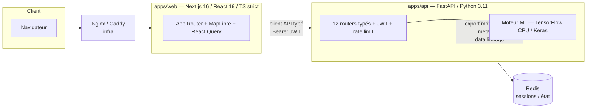

# MDL Redressement — application web full-stack + moteur ML de redressement de débits routiers

> Données FCD (Floating Car Data) brutes → entraînement de réseaux de neurones → évaluation statistique → cartographie et rapports. Une plateforme full-stack (Next.js + FastAPI) qui industrialise le redressement de débits routiers : du fichier brut au GeoJSON cartographié, avec traçabilité ML de bout en bout.

Auteur : **Samir Anbri** — dépôt portfolio (CV technique).
Démo : <https://Trafic-Tool.anbri-tools-ia.online>

---

## Aperçu / Démo

**Démo en ligne :** <https://Trafic-Tool.anbri-tools-ia.online>

**Vidéo de démonstration :** _à intégrer._
<!--
  Pour une vidéo lisible directement dans ce README, deux options :
  1. (Recommandé) Sur github.com, éditer ce README et GLISSER-DÉPOSER le .mp4
     dans la zone d'édition : GitHub héberge le fichier et insère un lecteur
     vidéo inline. Coller ici l'URL générée (https://github.com/user-attachments/assets/…).
  2. GIF court : placer le fichier en docs/screenshots/demo.gif puis décommenter :
       
-->

L'outil couvre quatre flux métier : modèle **Tous Véhicules (TV)**, modèle **Poids Lourds (PL)**, **Carte de débits** (application des modèles sur réseau FCD → GeoJSON) et **Fichier Compteurs** (export standardisé).

### Aperçu animé

| Écran de connexion | Écran d'accueil |
|:---:|:---:|
|  |  |

_Captures des autres modules en cours d'intégration — voir [`docs/screenshots/`](docs/screenshots/) pour la convention de nommage._

---

## Architecture



Monorepo **Turborepo** (`turbo.json`, workspaces `apps/*`). Conteneurisation et reverse-proxy dans `infra/` (Docker Compose, `Dockerfile.api`, `Dockerfile.web`, `nginx.conf`, `Caddyfile`).

---

## Stack technique

| Couche | Technologies |
|---|---|
| Monorepo / build | Turborepo, npm workspaces, Node ≥ 20 |
| Frontend | Next.js 16 (App Router), React 19, TypeScript 5 (`strict: true`), Tailwind CSS v4, shadcn/ui, MapLibre GL, TanStack React Query, Zustand, Framer Motion, GSAP, Recharts |
| Backend | FastAPI, Pydantic / pydantic-settings, Uvicorn, python-jose (JWT), bcrypt, SlowAPI (rate limiting), pandas, geopandas, scipy, scikit-learn |
| ML | TensorFlow CPU + Keras, NumPy, scikit-learn |
| Données / état | Redis (sessions, fallback in-memory), PyArrow, GeoJSON / EPSG:4326 |
| Observabilité | Sentry, Prometheus (`prometheus-fastapi-instrumentator`), logs JSON structurés + request-id |
| Infra / CI | Docker Compose, Nginx, Caddy, GitHub Actions (build multi-arch amd64/arm64, déploiement SSH) |
| Qualité | pytest, ruff, black, mypy, ESLint |

---

## Backend (FastAPI)

API typée Python 3.11, points forts vérifiés dans le code :

- **12 routers métier** (`apps/api/app/routers/`) : `upload`, `mapping`, `training`, `evaluation`, `export`, `carte`, `evolution`, `compteurs`, `models`, `visualisation`, `discontinuites`, `sessions`.
- **Auth obligatoire sans boilerplate** : chaque router métier est monté avec `dependencies=[Depends(get_current_user)]` (`main.py`). Seuls `/api/auth/*` et `/health` restent publics.
- **Gestion d'erreurs métier** : `error_messages.py` traduit les exceptions Python/pandas/numpy/TF en messages FR actionnables ; le handler global ne fuite jamais la classe ni le message Python au client (loggés côté serveur avec un request-id).
- **Validation de bout en bout** via Pydantic ; normalisation des erreurs 422 côté client.
- **Rate limiting** (SlowAPI, `rate_limit.py`) et middleware dédié.
- **Cycle de vie** géré (`lifespan`) : nettoyage périodique des sessions expirées, init Sentry conditionnelle.
- **Observabilité** : logs JSON structurés (`logging_config.py`), métriques Prometheus, intégration Sentry.

## Frontend (Next.js / React / TypeScript)

- **Next.js 16 App Router** (`apps/web/app/`) : routes métier `carte`, `compteurs`, `discontinuites`, `evolution`, `visualisation`, `login`, `register`, et un groupe de pipeline `(pipeline)` (donnees → config → training → evaluation → extrapolation).
- **TypeScript strict** (`tsconfig.json` → `"strict": true`) sur l'ensemble de la base front.
- **Client API typé** (`lib/api.ts`) : classe `ApiError` dédiée, injection automatique du `Bearer` JWT, gestion centralisée du 401 (purge token + redirection `/login`), timeouts via `AbortController` (30 s par défaut, 5 min pour les uploads), parsing robuste des erreurs FastAPI (string ou tableau Pydantic).
- **Cartographie MapLibre GL** : rendu de réseaux routiers volumineux (12–15k segments) en runtime, palettes et styles dédiés (`lib/map/`, `lib/map-palette.ts`, `lib/map-style.ts`).
- **Data layer** : TanStack React Query (hooks métier `lib/hooks/` : upload, training-status, eval-run, carte-generation…) + store Zustand persistant (`lib/store.ts`).
- **Accessibilité / motion** : respect de `prefers-reduced-motion` dans les utilitaires d'animation (`lib/animations/`, `lib/success-effects.ts`) et composants associés.
- UI : Tailwind CSS v4 + shadcn/ui (`components.json`, `components/ui/`).

## Moteur ML

Code dans `apps/api/app/services/ml/` (TensorFlow CPU, GPU systématiquement désactivé avant import TF) :

- **Pertes custom** (`losses.py`) sérialisables Keras : `HuberLoss` (delta paramétrable), `ToleranceAwareLoss` (MAE + pénalité hors-tolérance), `PinballLoss` (quantile) et tête **multi-quantile** (q ∈ {0.2, 0.5, 0.8}) avec somme de pinballs.
- **MLP Keras paramétrable** (`model_builder.py`) : embedding appris pour l'année, AdamW + weight decay L2, SELU / AlphaDropout, skip-connections, dropout adaptatif, clipnorm, LayerNorm/BatchNorm — chaque flag conserve un comportement par défaut byte-identique pour la rétro-compat des checkpoints.
- **Anti-fuite de données** : normalisation/cible ajustées **sur le train uniquement** (`normalize.py`), coefficients (`muX/SX/muY/SY`) exportés avec le modèle.
- **Évaluation statistique rigoureuse** (`metrics_advanced.py`, `stats_compare.py`, `kfold.py`) :
  - intervalles de confiance **bootstrap CI95** (1000 rééchantillonnages, seed fixe) ;
  - **drift temporel** annuel (R²/MAE/tol/p80 par année) ;
  - **test de McNemar pairé** (correction de continuité ≥ 25 paires, binomial exact sinon) pour comparer deux modèles sur l'appartenance à la bande de tolérance ;
  - **k-fold** réutilisant le pipeline d'entraînement public (même seeding, mêmes callbacks) pour mesurer la variance ;
  - stratification par volume de trafic, calibration pred/obs, résidus par classe fonctionnelle.

## MLOps & reproductibilité

- **Reproductibilité bit-exacte** (`seeding.py`) : seed projet **1750**, `seed_everything` couvre Python / NumPy / TF / Keras + `tf.config.experimental.enable_op_determinism()`, et re-seed par run dans la boucle de grid-search (`derive_seed`).
- **Packaging traçable** (`packaging.py`) : export modèle en archive ZIP avec un `meta.json` de **data lineage** — versions des libs (TF, Keras, NumPy, scikit-learn, Python), `git_sha` du code, seed, et **hash SHA-256 des données** (`data_sha256_of`). Round-trip `model.save()` / `load_model()` garanti.
- **Garde-fous d'entraînement** (`training_guard.py`) et budget temps configurable (`MDL_MAX_TRAINING_MINUTES`).

## Sécurité

Points vérifiés dans le code :

- **JWT fail-fast au boot** (`config.py`) : l'API refuse de démarrer si `JWT_SECRET` est vide, contient `change-me`, ou fait moins de 32 caractères.
- **Anti-IDOR** (`tests/test_ownership.py`, `session.py`) : l'accès à une session d'un autre utilisateur renvoie **404 et non 403** — pour ne pas divulguer l'existence de la ressource.
- **Anti path-traversal** (`security.py`) : namespacing disque par utilisateur ET par session, `validate_path` résout les symlinks des deux côtés et rejette toute sortie du root autorisé, ainsi que les octets NUL.
- **Anti zip-bomb** (`routers/upload.py`) : contrôle de la taille décompressée totale (limite 1 Go) avant traitement des archives shapefile.
- **Headers OWASP** (`middleware/security_headers.py`) : HSTS, CSP, `X-Frame-Options: DENY`, `X-Content-Type-Options: nosniff`, `Referrer-Policy`, `Permissions-Policy` sur chaque réponse (y compris erreurs).
- **Durcissement production** : `/docs`, `/redoc`, `/openapi.json` désactivés, `/metrics` restreint par allow-list d'IP, `/health` minimal, CORS strict limité aux origines configurées.
- **Mots de passe** : bcrypt (`auth.py`). Aucun seed utilisateur en production.

## Tests & CI

- **pytest** (`apps/api/tests/`, ~30 fichiers) : fixtures métier, transformations de données (`test_data_prep`, `test_normalize`, `test_mapping`), ML (`test_losses`, `test_seeding`, `test_packaging`, `test_grid_search`, `test_stats_compare`), sécurité (`test_ownership` IDOR + path-traversal, `test_security_headers`, `test_auth_flow`), et tous les routers.
- **CI GitHub Actions** (`.github/workflows/ci.yml`) : `ruff` + `black --check` (backend), `eslint` (frontend), `pytest` avec service Redis, puis build d'images Docker **multi-arch (amd64/arm64)** poussées sur GHCR et déploiement SSH (avec approbation manuelle via environnement `production`).

## Méthodologie

Étude de cas mise en avant : **détection de discontinuités de débits TVr** sur un réseau HERE de **241 857 brins** — voir [`scripts/discontinuity_methodology/00_METHODOLOGY.md`](scripts/discontinuity_methodology/00_METHODOLOGY.md).

Document maître auto-suffisant (reconstruction de graphe dirigé, continuité inter-brins, conservation des flux aux nœuds via GEH, score de sévérité composite anti-double-count), avec exemples numériques, checklist de tests unitaires, budgets de performance, et une section **« open questions for human review »** documentant les décisions bloquantes/différables — démarche de revue adversariale assumée.

## Démarrer

Prérequis : Node ≥ 20, Python 3.11.

```bash
# 1. Variables d'environnement (cf. .env.example)
#    JWT_SECRET est REQUIS (≥ 32 chars) — sinon l'API refuse de démarrer :
#    openssl rand -hex 32
cp .env.example .env   # puis renseigner JWT_SECRET

# 2. Frontend
npm install

# 3. Backend
cd apps/api
python -m venv .venv && source .venv/bin/activate   # .venv\Scripts\activate sous Windows
pip install -e ".[dev,prod]"
cd ../..
```

Lancer en développement :

```bash
npm run dev            # turbo : web + api en parallèle
# ou séparément :
npm run dev:web        # Next.js (port 3000)
npm run dev:api        # uvicorn app.main:app --reload (port 8000)
```

Avec Docker :

```bash
npm run docker:up      # docker compose -f infra/docker-compose.yml up --build
npm run docker:down
```

## Structure du dépôt

```
.
├── apps/
│   ├── web/                  # Frontend Next.js 16 (App Router, TS strict, MapLibre)
│   │   ├── app/              # routes (pipeline, carte, evolution, discontinuites…)
│   │   ├── components/       # UI (shadcn/ui), cartes, charts, upload…
│   │   └── lib/              # client API typé, hooks React Query, store, map, i18n
│   └── api/                  # Backend FastAPI (Python 3.11)
│       ├── app/
│       │   ├── routers/      # 12 routers métier
│       │   ├── services/ml/  # moteur ML (losses, model_builder, seeding, packaging…)
│       │   ├── middleware/   # security headers
│       │   ├── auth.py  config.py  security.py  error_messages.py  rate_limit.py
│       │   └── main.py       # wiring FastAPI (auth, CORS, metrics, lifespan)
│       └── tests/            # pytest (métier, ML, sécurité IDOR/path/headers)
├── scripts/
│   └── discontinuity_methodology/   # méthodologie discontinuités TVr (étude de cas)
├── infra/                    # Docker Compose, Dockerfiles, nginx.conf, Caddyfile
├── .github/workflows/ci.yml  # lint + tests + build multi-arch + déploiement
├── turbo.json                # pipeline Turborepo
└── .env.example
```
